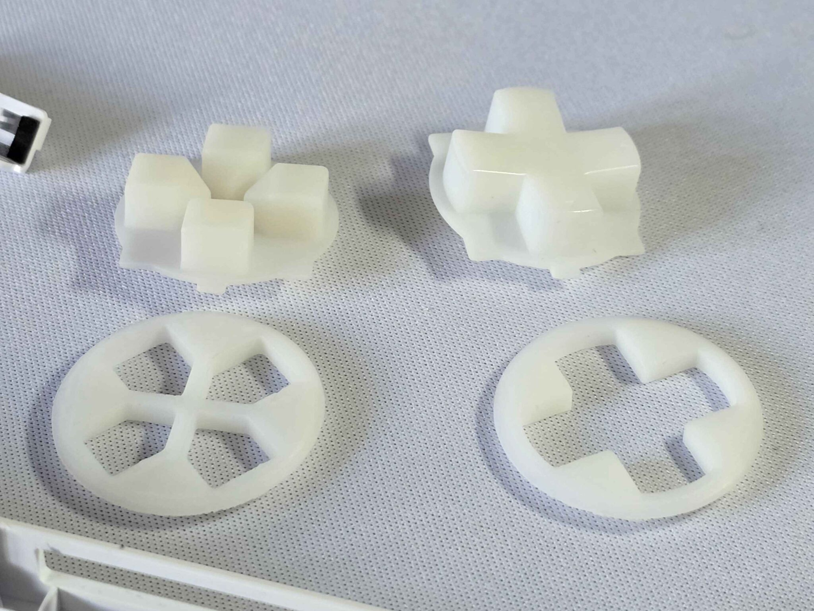

# ROG Ally – DualShock D-Pad Mod Guide

This is a guide and general overview of how to install and upgrade your **ROG Ally D-Pad** with a custom-printed DualShock-style replacement.

---

## Credit
- **YesitsKira** – Modeling  

---

## Materials Needed
- Precision screwdriver set  
- Plastic pry tool  
- FDM or SLA printer (**SLA [resin] recommended for best results**)  
- Download and print D-Pad replacement (**[Here]**)  

---

## Notes
- ⚠️ **By following this guide, you take responsibility for your own actions.**  
- This mod *should not* void your warranty, but always double-check with customer service depending on your region and local laws.  
- The red **"warranty void"** stickers on the battery and heat pipe **do not** void your warranty, provided you restore the device to factory condition before an RMA.  
- Be very careful when removing the **back panel, paddle, and trigger screws**, as they can strip easily!  

---

## Printing the Base
- Post-processing the printed base is **critical**.  
- Small defects in the print can lead to:
  - Poor feedback  
  - False inputs  
  - No inputs  
- For best results:
  - Use a **resin (SLA) printer** for high accuracy.  
  - If using FDM, make sure your printer is very well calibrated.  
  - Apply **slight heat** to the bottom of the metal D-Pad and press it into the printed part for proper clearance.  

  
  

---

## Installation

The ROG Ally is one of the **easiest Windows handhelds to disassemble**.  
📺 **Watch the teardown here:** [ifixit Teardown Video](https://www.youtube.com/watch?v=IxPgBhm6tHs)  

---

### Steps

1. **Remove back panel**  
   - Unscrew all screws and carefully pry off the back.  
   - Unplug the battery.  

2. **Remove battery**  
   - Remove the 4 screws holding it in place.  

3. **Remove both joystick boards**  
   - Disconnect **3 ribbon cables**  
   - Remove **4 screws**  
   - Unplug the **speaker cable**  

4. **Remove cooling system**  
   - Unplug fan headers  
   - Remove fan screws and fans  

5. **Disconnect wireless card**  
   - Unplug the **2 antenna cables**  

6. **Disconnect display**  
   - Remove the display ribbon cable  
   - Unplug the speaker connector  

7. **Remove motherboard**  
   - Unscrew all **12 screws**  
   - Either:
     - Tilt and lift the motherboard fully out, **or**  
     - Tilt just enough to slide the stock D-Pad out and insert the new DualShock D-Pad.  

⚙️ Ensure the **bottom tab of the new D-Pad points downward** so it aligns correctly when installed.

---

✅ Once reassembled, your Ally will have a DualShock-style D-Pad for improved ergonomics and feedback.

  
  
